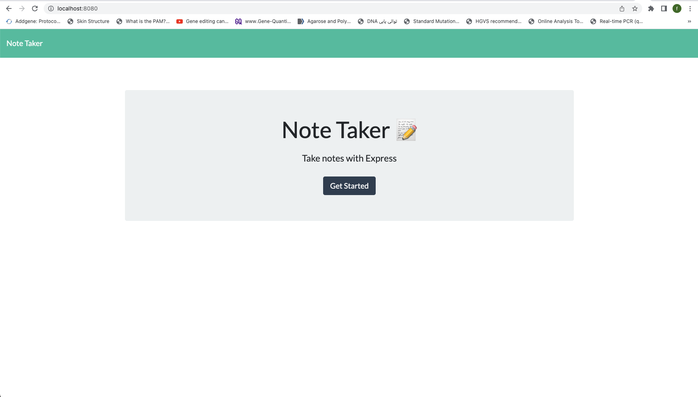
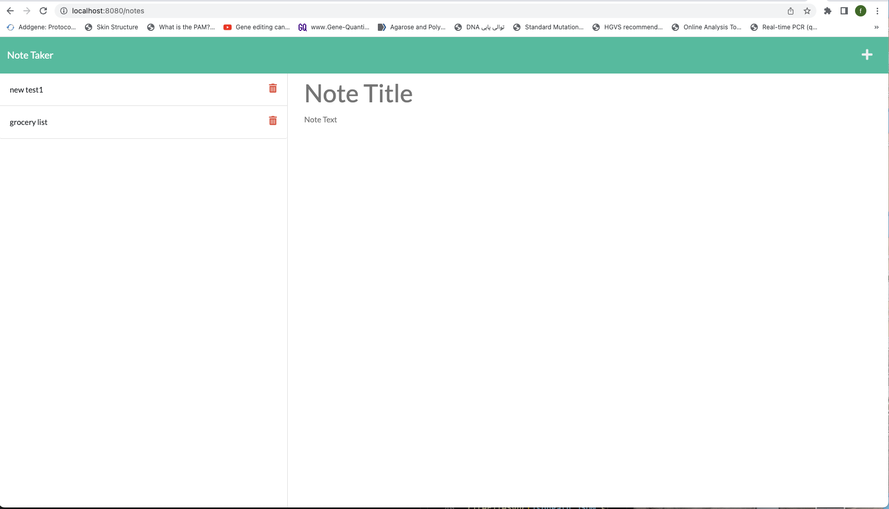
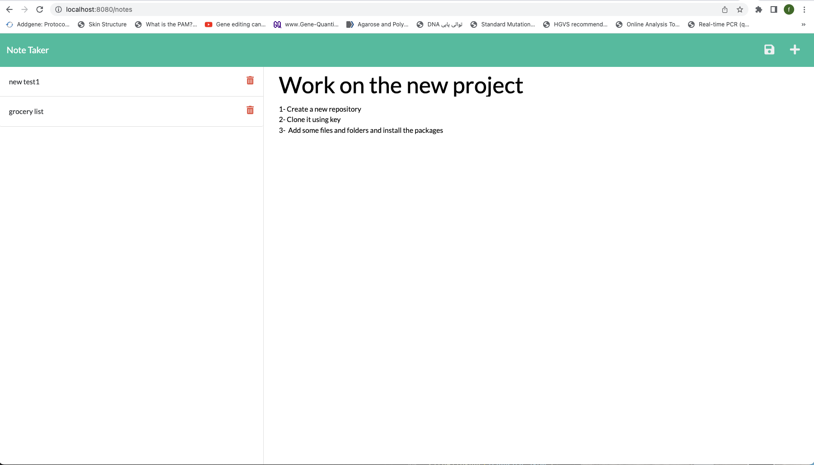
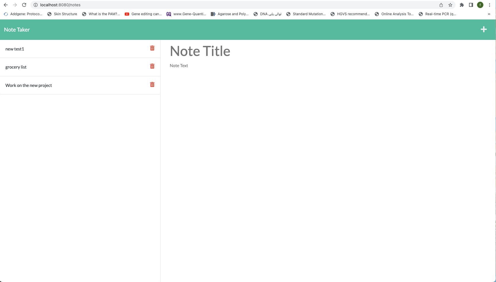
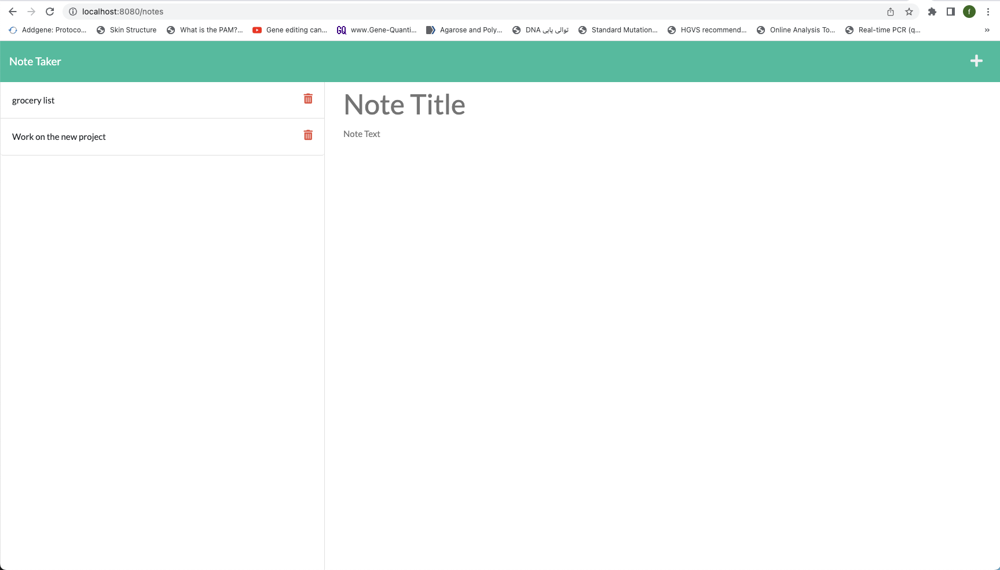

# # Note-Taker

## Task Description
To create a user friendly application called Note Taker which enables the user to write, save and delete the notes. To be abe to save and retrive the note data from the Json file, use the Express.js for the back end part.
After building the back end, make sure to connect the it to the front end, also deploy the entire Note Taker application to Heroku.

## Acceptance Criteria
> when users opens the homepage of the Note Taker application, they should be able to click on Get Started button which leads them to another page.

>Then, in this new page users should be able to view their exsising notes (if they created and saved any notes previously) on the left side of the page that had been listed with their titles.

> User should be able to click on any of their already existing notes that are listed on the left side of the page and by clicking on each note they should be able to view the title of that note with its description under it (the note) on the right side of the page.

> User should be able to make a new Note by clicking on the plus sign (+) on the top right side of the page and should be able to type the title and the description of that note.

> Then, Users should be able to save the note by clicking on the save sign on the top right side of the page.

> Then, after saving that new note, user should be able to view the title of this new note which is listed on the left side of the page under previously created notes.

> Users should be able to delete any of their notes by clicking on the red trash bin infront of (on the right side of)that specific note 

## Mock-Up
To view the web application's appearance and functionality follow the link below:

## License 
MIT License, version 2022
